# 学习资源区

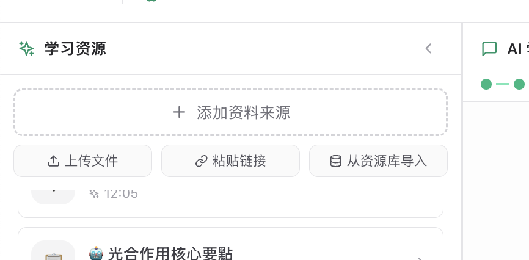

当前学习资源区共有四个按钮：

1. 一个大的“添加资料来源”按钮
2. 三个小按钮

把“添加资料来源”的 label 改成“上传文件”（它实际上也是统一弹窗）。

下面的三个按钮分别是：

1. 从资源库导入
2. 粘贴链接
3. 直接粘贴文本

其中“粘贴文本”应该是一个新的录入方式，点击后会打开一个弹窗。弹窗里有一个多行的 Text Area 可以输入，底部有两个按钮：一个是“保存”，一个是“确定”。

# 学习任务

1. 已完成任务的样式不好。样式不对

【目前的】

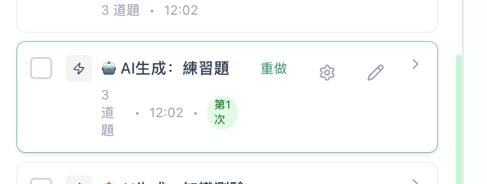

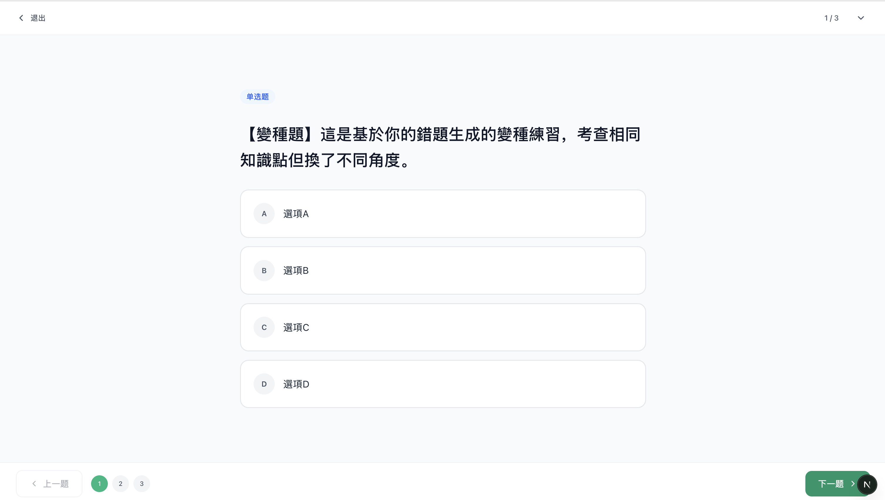

【notebookllm的】

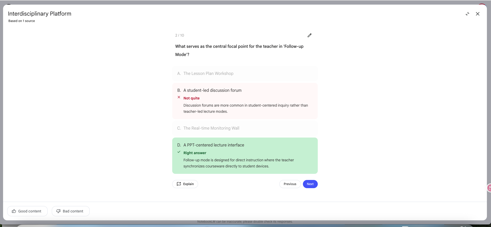

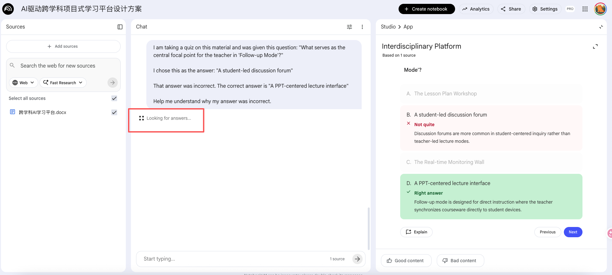

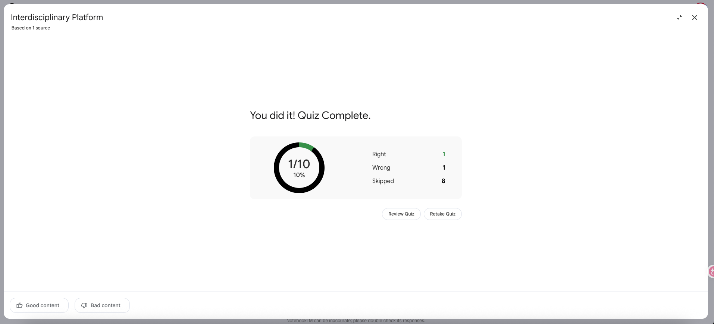

2.学习任务区域的生成

目前其实配置生成是有点乱的：

学生任务拦应该只有一个手动添加的按钮，因为AI生成按钮在右边学习工具区。

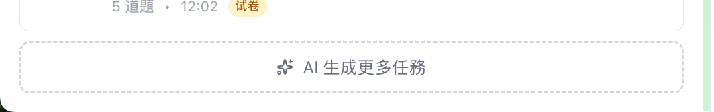

然后学习工具区的每个按钮其实点击之前是可以个性化配置的：

<pre class="vditor-reset" placeholder="" contenteditable="true" spellcheck="false">

</pre>

生成了以后任务又有2个弹窗来配置，弹窗中的配置又可以可以AI生成啥的。我觉得非常乱。这里的整体交互我们要重新梳理

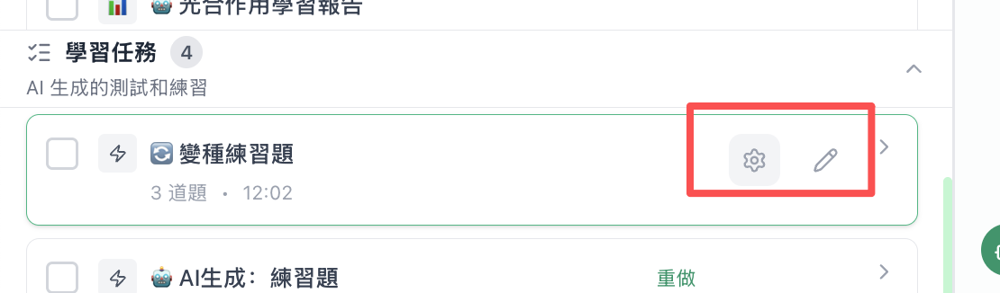

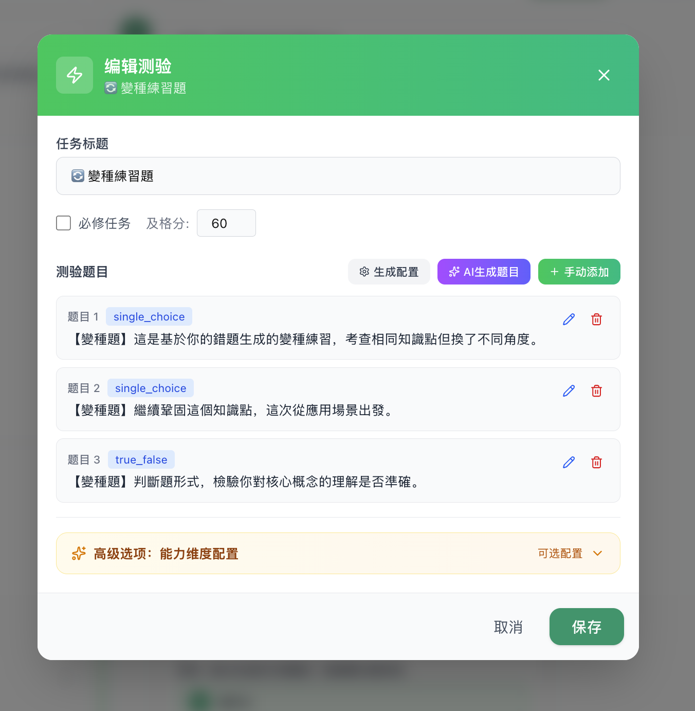

# 中间聊天区

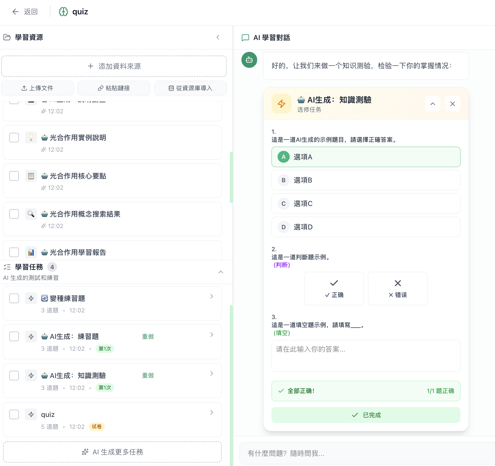

1. 试卷在聊天中不要展开很占用位置，使用缩起的试卷组件卡片
2. 按钮和推荐回复2选1，有推荐回复就不要按钮。
3. 我希望的的功能按钮，其实不应该是按钮，而是组件卡片，带说明，好看的组件卡片，
   类似这种：

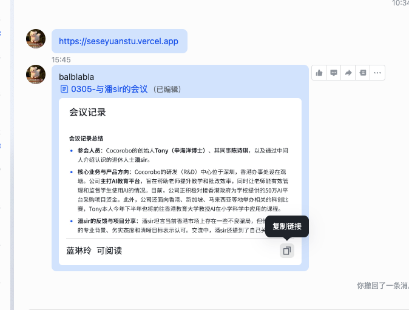

然后聊天中也需要加入这种

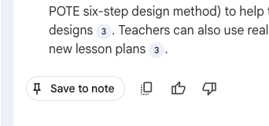

# Header栏

配置界面不太对，名字也不对，弹窗套弹窗的做法很怪！

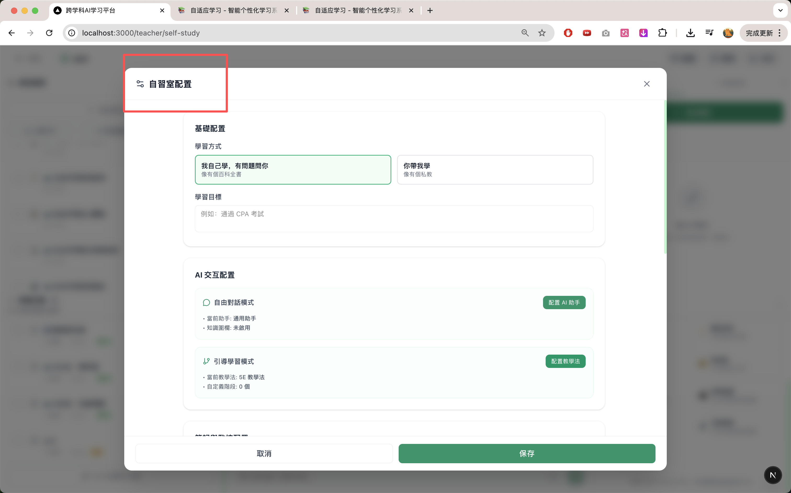

发布成功的弹窗参考这个修改一下（但是抱持绿色）：

主要是要有二维码

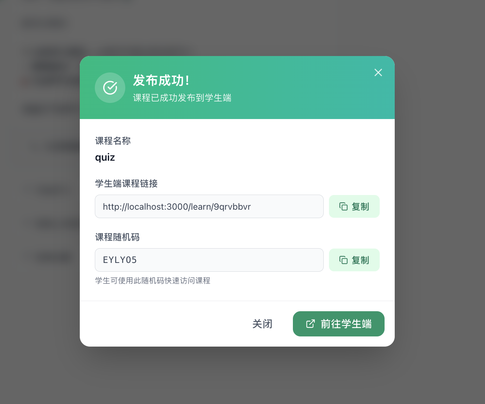

【参考】

# 学习状态

右侧的学习规则的颜色有点乱，最好是每一类任务对应一个颜色，例如：

1. 学习是一个颜色
2. 完成任务是一个颜色
3. AI 主场是一个颜色
4. 其他是一个颜色

这样子我们通过简单查看就可以一目了然。

另外，这个板块需要是可以收起的。或者说，你需要考虑一下处于“空状态”的时候该如何显示。

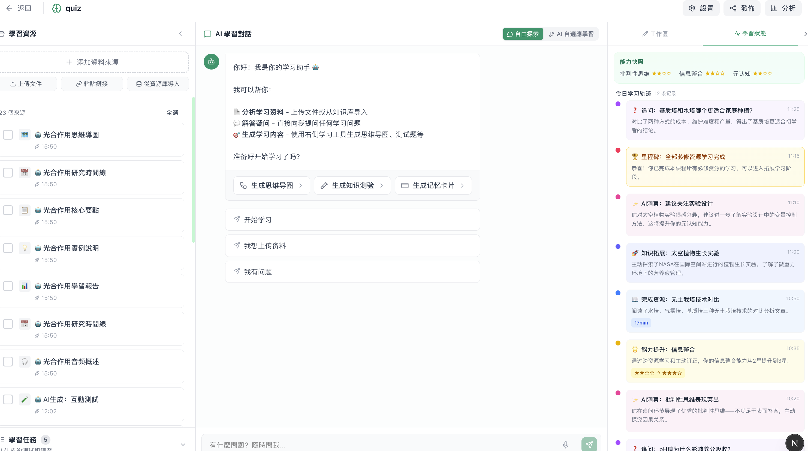

# 笔记栏

添加增加到source / 保存到笔记栏
