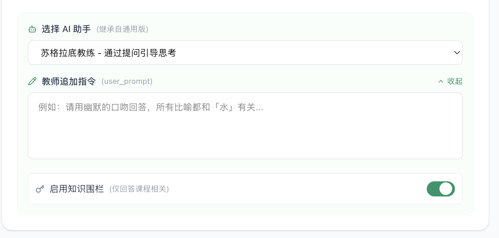

# Workbench UI 改进 PRD

> 日期：2026-03-06
> 涉及文件对照：见 `src/app/teacher/self-study/ARCHITECTURE.md`

---

## 1. 学习资源区

> 涉及文件：`workbench/resource/LeftPanel.tsx`（UI）、新建 `PasteTextModal.tsx`

### 1.1 按钮重命名

**当前状态：**


- 大按钮：「+ 添加资料来源」（点击打开统一资源导入弹窗）
- 三个小按钮：「上传文件」「粘贴链接」「从资源库导入」

**改为：**

| 位置     | 当前 label   | 新 label     | 点击行为                           | 变更类型       |
| -------- | ------------ | ------------ | ---------------------------------- | -------------- |
| 大按钮   | 添加资料来源 | 上传文件     | 不变，仍打开统一资源导入弹窗       | 仅改文案       |
| 小按钮 1 | 上传文件     | 从资源库导入 | 不变                               | 仅改文案和位置 |
| 小按钮 2 | 粘贴链接     | 粘贴链接     | 不变                               | 无变化         |
| 小按钮 3 | 从资源库导入 | 直接粘贴文本 | **新功能**：打开粘贴文本弹窗 | 新增           |

### 1.2 新增：「粘贴文本」弹窗

**触发方式：** 点击小按钮「直接粘贴文本」

**弹窗内容：**

- 标题：「粘贴文本」
- 主体：一个多行 TextArea，placeholder 例如「在此粘贴或输入文本内容...」
- 底部两个按钮：「取消」（关闭弹窗）、「确定」（将文本作为资源添加到学习资源列表并关闭弹窗）

---

## 2. 学习任务

> 涉及文件：`workbench/resource/LeftPanel.tsx`（任务列表 UI）、`task/TaskExpandedCard.tsx`（做题界面）、`task/TaskResultReview.tsx`（结果页）、`SelfStudyWorkbench.tsx`（handler 逻辑）

### 2.1 任务卡片样式优化

**问题：** 当前已完成任务卡片样式粗糙，信息密度高但不美观。

**当前状态：**


- 卡片内有：checkbox、闪电图标、emoji+标题、「重做」链接、齿轮、铅笔、展开箭头
- 已做过的任务额外显示「第1次」badge
- 整体拥挤，操作按钮太多直接外露

**参考（NotebookLM）：**


**改动要点：**

卡片视觉简化：默认只显示标题 + 状态（题数、完成情况）

***操作按钮合并：只需要一个编辑按钮即可。两个弹窗合并为一个（见2.4）***

***重做按钮应该放到完成界面***


2.2 做题界面改进

**当前状态：**


- 全屏覆盖式，顶部「退出」+ 题号分页 1/3
- 选项为灰色圆角卡片，无答题反馈

**参考（NotebookLM）：**

***样式改进***


非全屏，而是95%全屏


### 2.3 完成总结页改进

**参考（NotebookLM）：**


**改动要点：**

- 展示环形进度图：正确数/总数 + 百分比
- 右侧分项统计：Right / Wrong / Skipped 各多少题
- 底部两个按钮：回顾错题、重做、回到AI对话

### 2.4 任务生成交互简化

**问题：** 当前任务生成路径混乱，涉及多层配置弹窗。

**当前混乱的流程：**

```
右侧学习工具区点击「知识测验」
  → 可先点铅笔图标打开「工具配置」弹窗（输出详细度/语言/难度）
  → 点击工具本身触发生成
  → 生成后任务出现在左侧任务列表
  → 任务卡片上有齿轮图标 → 打开「任务设置」popover（可见性/必修）
  → 任务卡片上有铅笔图标 → 打开「编辑测验」全屏弹窗
    → 弹窗内又有「生成配置」「AI生成题目」「手动添加」三个按钮
```

问题总结：

1. 左侧任务栏既有「AI 生成更多任务」按钮又右侧有生成工具，入口重复
2. 生成前有配置弹窗，生成后又有编辑弹窗，编辑弹窗里还能再生成，层级混乱
3. 任务设置（权限/可见性）和内容编辑分散在两个不同入口（齿轮 vs 铅笔）

**简化后的流程：**

```
[生成路径]
右侧学习工具区点击工具卡片（如「知识测验」）
  → 情况A：直接点击 → 使用默认参数立即生成，任务出现在左侧
  → 情况B：hover 工具卡片出现配置图标 → 点击打开配置面板 → 调整参数后点「生成」
  - 情况C：直接在左侧任务栏中点击【手动添加】添加

[编辑路径]
左侧任务列表点击任务卡片的编辑入口（hover 出现）
  → 打开统一的「编辑任务」弹窗
  → 弹窗内合并所有配置：
    - 任务标题
    - 题目列表
      -- 每道题权限设置（必修/可见性）  ← 原来的齿轮 popover 内容合并到这里
      -- 编辑（直接可编辑，可拖动，可删除，无需再打开弹窗）
      -- 添加（AI/人工）
    - 高级选项（能力维度配置）
```

**关键改动：**

1. **删除**左侧任务栏的「AI 生成更多任务」按钮（AI 生成统一从右侧工具区发起）
2. 左侧任务栏只保留一个「+ 手动添加」按钮
3. **合并**齿轮（任务设置）和铅笔（内容编辑）为单一「编辑」入口 → 打开一个统一弹窗

---

## 3. 中间聊天区

> 涉及文件：`workbench/chat/ChatPanel.tsx`（UI）、`SelfStudyWorkbench.tsx`（handler）

**当前状态：**


### 3.1 任务卡片在聊天中折叠

**问题：** 任务/试卷在聊天消息中完整展开（显示所有题目），占用大量对话空间。

**改为：** 使用折叠式任务卡片：

- 默认显示：任务图标 + 标题 + 题数 + 状态标签（如「未完成」/「已完成 3/5」）
- 点击卡片展开做题界面（全屏）
- 折叠卡片高度控制在 60-80px

### 3.2 按钮 vs 推荐回复二选一

**问题：** 当前功能按钮和推荐回复同时出现，视觉冗余。

**规则：**

- 如果 AI 回复中包含推荐回复（suggested replies），**不显示**功能按钮
- 如果没有推荐回复，才显示功能按钮/卡片
- 两者互斥，不同时出现

### 3.3 功能按钮改为组件卡片

**问题：** 当前功能按钮（「生成思维导图」「生成知识测验」「生成记忆卡片」等）是朴素的文字按钮，缺乏说明，不直观。

**参考：**


**改为富卡片样式（参考右侧学习工具卡片）：**

- 每个功能显示为一张小卡片，包含：
  - 图标（左侧）
  - 标题（如「生成知识测验」）
  - 简短描述（如「基于学习资料自动生成测试题」）
  - hover状态的配置按钮（同学习工具卡片）
- 卡片可带交互，点击触发对应功能
- 每次推荐的卡片数量必须是如下数字（0，1，2，4），没需要的话不推荐，不要推荐超过4个。
- 卡片排列：横向排列或 2 列网格，每行 2 张

### 3.4 AI 回复增加「保存到笔记」操作

**参考：**


**实现方式：**

- 每条 AI 回复消息都有工具条（不选择hover的原因是要考虑ipad）
- 工具条包含：「保存到笔记」按钮（点击将该条回复内容保存到右侧笔记栏）
- 可选：额外增加「复制」「点赞/点踩」按钮

---

## 4. Header 栏

> 涉及文件：`workbench/header/WorkbenchHeader.tsx`、`SettingsModal`、`PublishModal`

### 4.1 设置弹窗修改

**当前问题：**


1. 弹窗标题「自习室配置」→ 改为「自学空间」
2. 弹窗套弹窗：点击「配置 AI 助手」或「配置教学法」会弹出子弹窗，体验差

**改动要点：**

- 标题改为「自学空间」
- 子配置（自由对话模式 / 引导学习模式）改为**在同一弹窗内的不同section**，不再弹出
  - 「配置 AI 助手」section→ 选择默认的AI助手，输入追加指令
  - 「配置教学法」section
  - 使用 accordion/collapse 手风琴交互

### 4.2 发布成功弹窗改进

**当前状态：**


- 有课程名称、链接、随机码、「关闭」/「前往学生端」按钮
- 缺少二维码

**参考（CocoStudy）：**


**改动要点：**

- 保持绿色主题不变
- 新增：**二维码**展示区（居中），下方提供「下载二维码」链接
- 保留：测验链接 + 复制按钮、课程码 + 复制按钮
- 底部按钮改为：「继续发布到其他班级」+「完成」

---

## 5. 学习状态（右侧面板）

> 涉及文件：`workbench/workspace/LearningStatusPanel.tsx`

**当前状态：**


- 今日学习轨迹的时间线节点颜色混乱（红、蓝、黄、绿、粉随机使用），难以快速辨识类别

### 5.1 统一颜色分类

**规则：每类事件固定一个颜色**

| 事件类别                    | 颜色      | 示例事件                         |
| --------------------------- | --------- | -------------------------------- |
| 学习（阅读资源、浏览内容）  | 浅蓝色    | 「完成资源：无土栽培技术对比」   |
| 完成任务（做题、提交）      | 浅绿色    | 「里程碑：全部必修资源学习完成」 |
| AI 主场（AI 对话、AI 洞察） | 浅紫色    | 「AI洞察：批判性思维表现突出」   |
| 其他（提问、能力变化等）    | 灰色/橙色 | 「追问：pH值为什么影响...」      |

### 5.2 支持折叠

- 学习状态面板标题栏增加折叠/展开按钮
- 折叠后只显示标题 + 简要摘要（如「今日学习 45min · 完成 3 个任务」）

### 5.3 空状态设计

- 当没有任何学习记录时，显示引导性空状态：
  - 插图/图标
  - 文案例如「开始学习后，你的学习轨迹将在这里显示」

---

## 6. 笔记栏（右侧面板）

> 涉及文件：`workbench/workspace/EnhancedNotesPanel.tsx`

### 6.1 增加「添加到资源」功能

- 笔记条目增加操作入口（hover 显示或菜单内）
- 点击「添加到资源」→ 将该笔记内容作为一条学习资源，添加到左侧学习资源列表
- 添加后在笔记上显示已关联标记

---

## 变更总结

| Section            | 变更类型            | 复杂度 | 涉及主要文件                                            |
| ------------------ | ------------------- | ------ | ------------------------------------------------------- |
| 1. 资源区按钮      | 文案修改 + 新增弹窗 | 低     | LeftPanel.tsx + 新建 PasteTextModal.tsx                 |
| 2.1 任务卡片样式   | UI 重做             | 中     | LeftPanel.tsx                                           |
| 2.2 做题界面       | UI + 逻辑           | 中     | TaskExpandedCard.tsx                                    |
| 2.3 完成总结页     | UI 重做             | 低     | TaskResultReview.tsx                                    |
| 2.4 任务生成简化   | 交互重构            | 高     | LeftPanel.tsx + SelfStudyWorkbench.tsx + RightPanel.tsx |
| 3.1 聊天中任务折叠 | UI                  | 中     | ChatPanel.tsx                                           |
| 3.2 按钮/回复互斥  | 逻辑                | 低     | ChatPanel.tsx                                           |
| 3.3 功能按钮→卡片 | UI 重做             | 中     | ChatPanel.tsx                                           |
| 3.4 保存到笔记     | 新功能              | 中     | ChatPanel.tsx + EnhancedNotesPanel.tsx                  |
| 4.1 设置弹窗       | UI + 交互           | 中     | SettingsModal                                           |
| 4.2 发布弹窗       | UI                  | 低     | PublishModal                                            |
| 5.1 颜色分类       | UI                  | 低     | LearningStatusPanel.tsx                                 |
| 5.2 面板折叠       | UI                  | 低     | LearningStatusPanel.tsx                                 |
| 5.3 空状态         | UI                  | 低     | LearningStatusPanel.tsx                                 |
| 6.1 添加到资源     | 新功能              | 中     | EnhancedNotesPanel.tsx + LeftPanel.tsx                  |
