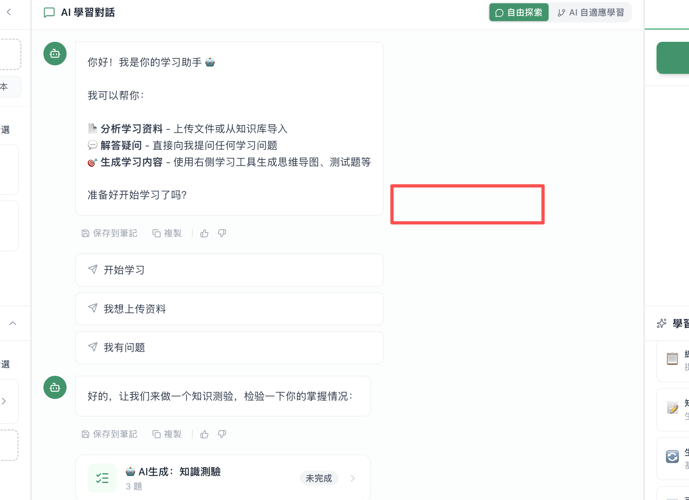
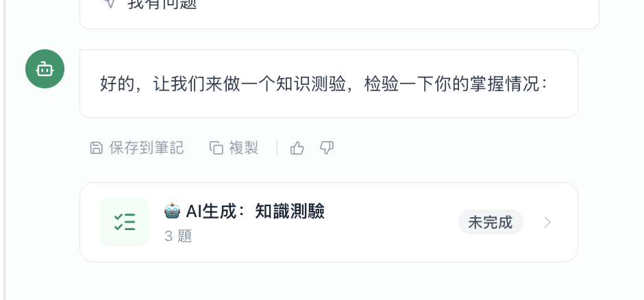

# # 大前提

我们是一个demo原型网站，我们主要要演示完毕demo和交互。主要问题是交互不顺畅。UI不够直观。整体感觉不好用

# 学习资源

当前学习资源点击后有3个状态：左侧embeed，中间大小窗口，97%窗口，我认为只需要有左侧embeed和97%窗口两个状态即可。还有一个是类似AI测验的那种卡片类型，可以在对话中推送给用户，点击后97%

# 学习任务拦

在整个学习任务的创设，做题，和解答都非常的混乱（交互方面）。你按照AI生成，手动生成，做题，做题后AI引导错题的这种思路来重新梳理一下当前的逻辑，交互，界面。你会发现非常多错误的地方。

# 聊天区

这个UI挺奇怪的。需要改善。我觉得干脆考虑放在右侧或者在兼容ipad的触摸事件的情况下，使用hover效果

# 设置弹窗

1.很多配置是混乱的重复的，和我们这个workbench实际不符合的
2.UI还需要改进
