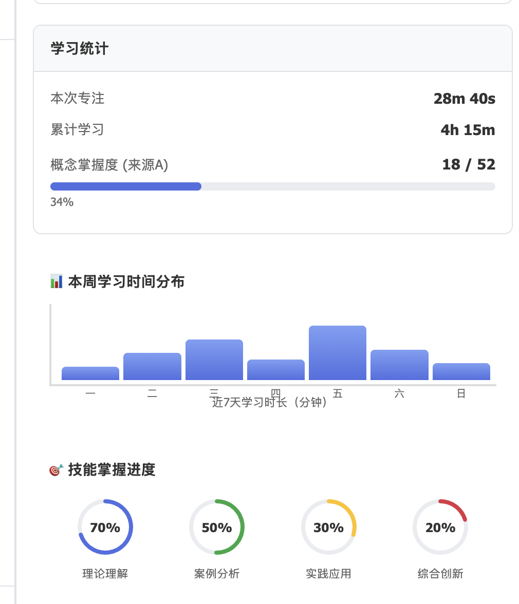

# 能力成长可视化重新设计方案

## 一、需求分析

### 1.1 核心问题

当前"我的能力成长"面板仅使用雷达图展示“"跨学科”"能力，存在以下问题：

- 无法适应不同数量的跨学科能力维度（0-多个）
- 无法适应学科素养的展示（不同学科有不同核心素养维度）
- 雷达图对1-2个维度展示效果差，且所有都是用雷达图显得乏味
- 超过6个维度时雷达图过于拥挤
- 未考虑到边缘情况

  - 小组协作时可能得分是基于小组来得到的，非跟人
  - 老师可能没有配置任何跨学科能力
  - 老师可能没有配置任何学科核心素养

### 1.2 设计约束

1. **仅前端原型**：基于真实项目做前端样式和交互
2. **跨学科能力和学科能力：**
3. **可视化优先**：强烈偏好图表和数据展示，禁止空状态消息
4. **0维度时完全隐藏**：隐藏整个模块而非"空状态"
5. 

### 1.3 跨跨学科-边缘情况处理策略

| 维度数量 | 可视化方案                  | 设计理由                         |
| -------- | --------------------------- | -------------------------------- |
| 0个      | 完全隐藏（`return null`） | 遵循"永不空状态"原则             |
| 1-2个    | 大尺寸水平进度条 + 文字描述 | 充分展示单一维度的详细信息       |
| 3-6个    | 雷达图 + 维度列表           | 雷达图最佳展示范围，保留现有方案 |
| 7+个     | 可滚动垂直条形图            | 紧凑排列，易于对比               |

# 用户实际看到的界面效果说明

## 场景一：理想情况（有跨学科能力 + 有学科素养）

**学生打开"我的能力成长"标签页，看到：**

### 场景1：只有2个以内跨学科能力（如"批判性思维"）

**看到2张大卡片：**

```
┌─────────────────────────────────────┐
│                                     │
│         批判性思维                  │
│                                     │
│      ⭐⭐⭐⭐⭐                      │  ← 5颗星
│                               │
│                                     │
│  当前水平：优秀                     │
│                                     │
│  "你在课堂讨论中展现了出色的        │
│   逻辑分析和质疑能力"               │  ← AI评语
│                                     │
│  趋势：↑ 较上周提升 3 分            │
│                                     │
└─────────────────────────────────────┘
```

**设计细节：**

* 星星大小：24px（醒目）
* 支持半星显示（4.25星 → 显示4颗满星 + 1颗半星）
* 

---

### 场景3：有5个跨学科能力

**看到标准雷达图：**

```
┌─────────────────────────────────────┐
│       跨学科能力画像                │
│                                     │
│          [五边形雷达图]             │  ← 5个顶点的雷达图
│                                     │
│  📊 详细评级：                      │
│  · 批判性思维  ⭐⭐⭐⭐⭐   ↑   │
│  · 团队协作    ⭐⭐⭐⭐     →   │
│  · 创新思维    ⭐⭐⭐   ↑   │
│  · 沟通表达    ⭐⭐⭐       ↓   │
│  · 问题解决    ⭐⭐⭐⭐     →   │
│                                     │
└─────────────────────────────────────┘
```

---

### 场景4：有10个跨学科能力（太多了）

**看到条形图（保持原方案）：**

```
┌─────────────────────────────────────┐
│       跨学科能力画像                │
│                                     │
│  批判性思维  ████████████ 85        │
│  团队协作    ██████████   72        │
│  创新思维    █████████████ 90       │
│  沟通表达    █████████    68        │
│  问题解决    ███████████  78        │
│  信息素养    ████████████ 82        │
│  ... (可滚动查看更多)               │
│                                     │
└─────────────────────────────────────┘
```

---

### 2️⃣ 中间区域 - 学科核心素养（垂直瀑布流）

**该课关联了学了数学、物理两门课**

看到 **垂直排列的两个区块** ：

```
┌──────────────────────────────────────┐
│ 📐 数学核心素养                      │
│                                      │
│  [数学的雷达图/条形图]               │ ← 根据数学素养维度数量自动选择
│  · 数学抽象: 88 ↑                   │
│  · 逻辑推理: 92 →                   │
│  · 数学建模: 75 ↓                   │
└──────────────────────────────────────┘

       ↓ （向下滚动）

┌──────────────────────────────────────┐
│ ⚛️ 物理核心素养                      │
│                                      │
│  [物理的雷达图/条形图]               │
│  · 科学探究: 80 ↑                   │
│  · 实验设计: 78 →                   │
└──────────────────────────────────────┘
```

 **每个学科区块颜色不同** （数学用蓝色、物理用紫色等）

---

### 3️⃣ 底部区域 - AI观察和学习统计

保持现有设计：

* AI观察：2条最新的AI评语卡片
* 学习统计：已完成课程数、累计学习时长

---

## 场景二：边缘情况

### 情况A：老师没配置跨学科能力（0个）

**用户看到：**

* ❌  **不显示** "跨学科能力"区域（完全隐藏，不是空状态提示）
* ✅ 直接显示"学科核心素养"区块
* ✅ 底部AI观察和统计正常显示

---

### 情况B：老师没配置学科素养（0个）

**用户看到：**

* ✅ 顶部"跨学科能力"正常显示
* ❌ **不显示**学科素养区域（完全隐藏）
* ✅ 底部AI观察和统计正常显示

---

### 情况C：什么都没配置（最极端）

**用户看到：**

* ❌ 跨学科能力：隐藏
* ❌ 学科素养：隐藏
* ✅  **仅显示** ：AI观察 + 学习统计

 **界面效果** ：

```
┌──────────────────────────────────────┐
│ ✨ AI实时观察                        │
│  [AI评语卡片1]                      │
│  [AI评语卡片2]                      │
└──────────────────────────────────────┘

┌──────────────────────────────────────┐
│ 📊 学习元数据                        │
│  已完成课程: 3门                    │
│  累计学习: 12小时                   │
└──────────────────────────────────────┘
```

---

### 情况D：只有1个跨学科能力

**用户看到：**

一个 **居中的大卡片** （占满宽度）：

```
┌─────────────────────────────────────┐
│                                     │
│         [超大圆形进度环]            │
│            92/100                   │
│                                     │
│          创新思维  ↑                │
│                                     │
│   "你提出了3个独创性的解决方案，    │
│    展现出卓越的创新能力"            │
│                                     │
└─────────────────────────────────────┘
```

---

### 情况E：小组协作评分的视觉标识

**用户看到的差异：**

普通个人评分的卡片：

```
┌─────────────────────┐
│   [进度环] 85       │
│   批判性思维        │
└─────────────────────┘
```

小组评分的卡片：

```
┌─────────────────────┐
│   [进度环] 72  👥   │ ← 右上角蓝色徽章，鼠标悬停显示"小组评分"
│   团队协作          │
└─────────────────────┘
```

---

## 场景三：不同学科素养维度数量的展示差异

### 数学有3个素养维度

**用户看到：** 小型雷达图

### 物理有8个素养维度

**用户看到：** 紧凑的条形图（更容易对比）

### 语文只有1个素养维度

**用户看到：** 大号水平进度条

---

## 总结：用户体验的核心原则

1. **永不空状态** - 没数据就隐藏，不显示"暂无数据"
2. **智能适配** - 根据维度数量自动选择最合适的图表
3. **信息密度** - 少量维度时大而详细，多维度时紧凑对比
4. **清晰标识** - 小组评分有明确视觉提示
5. **垂直浏览** - 所有内容自然向下滚动，无需横向切换

### 1.4 数据模型

```typescript
// 能力评分：1-4星
type CompetencyRating = 1 | 2 | 3 | 4;

// 能力趋势
type CompetencyTrend = 'ascending' | 'stable' | 'descending';

// 6种跨学科能力类型
type CompetencyType =
  | 'critical_thinking'      // 批判性思维 #3b82f6 🔍
  | 'information_synthesis'  // 信息整合 #10b981 🔗
  | 'metacognition'          // 元认知 #8b5cf6 💭
  | 'question_quality'       // 提问质量 #f59e0b ❓
  | 'creativity'             // 创造性 #ec4899 ✨
  | 'persistence';           // 坚持性 #ef4444 💪

// 灵活的能力画像类型（支持0-6个任意组合）
type CompetencyProfile = Partial<Record<CompetencyType, number>>;
```

---

## 二、技术方案

### 2.1 架构设计

#### 模块化组件系统

创建独立的可视化组件文件：`src/app/student/components/CompetencyVisualizations.tsx`

```
CompetencyVisualizations.tsx
├── LinearCompetencyView          (1-2维度)
├── RadarCompetencyView           (3-6维度)
├── BarCompetencyView             (7+维度)
├── CrossCourseGrowthTimeline     (跨课程追踪)
└── GroupCollaborationView        (小组协作对比)
```

#### 智能路由逻辑

在 `CompetencyGrowthPanel` 中根据维度数量自动选择组件：

```typescript
const competencyCount = Object.keys(competencyProfile).length;

if (competencyCount === 0) return null;
if (competencyCount <= 2) return <LinearCompetencyView />;
if (competencyCount <= 6) return <RadarCompetencyView />;
return <BarCompetencyView />;
```

### 2.2 组件实现细节

#### 2.2.1 LinearCompetencyView（1-2维度）

**设计特点**：

- 大尺寸进度条（h-8）充分利用空间
- 中央显示分数（如 "3/4"）
- 底部显示详细文字描述
- 支持"新维度"标签和趋势图标

**关键代码**：

```typescript
export function LinearCompetencyView({ competencies }: { competencies: CompetencyData[] }) {
  if (competencies.length === 0) return null;

  return (
    <div className="space-y-3">
      {competencies.map((comp) => {
        const metadata = COMPETENCY_METADATA[comp.type];
        const percentage = (comp.rating / 4) * 100;

        return (
          <div key={comp.type} className="space-y-2">
            {/* 标题行 */}
            <div className="flex items-center justify-between">
              <div className="flex items-center gap-2">
                <div className="w-3 h-3 rounded-full" style={{ backgroundColor: metadata.color }} />
                <span className="text-xs font-medium text-gray-700">
                  {metadata.icon} {metadata.name}
                </span>
                {comp.isNew && (
                  <span className="text-xs bg-accent-100 text-accent-700 px-2 py-0.5 rounded-full">
                    新维度
                  </span>
                )}
              </div>
              <div className="flex items-center gap-2">
                <span className="text-xs text-gray-500">{getCompetencyStars(comp.rating)}</span>
                {comp.trend && <span className="text-sm">{getTrendIcon(comp.trend)}</span>}
              </div>
            </div>

            {/* 大尺寸进度条 */}
            <div className="relative h-8 bg-gray-100 rounded-lg overflow-hidden">
              <div
                className="absolute inset-y-0 left-0 rounded-lg transition-all duration-500"
                style={{ width: `${percentage}%`, backgroundColor: metadata.color, opacity: 0.8 }}
              />
              <div className="absolute inset-0 flex items-center justify-center">
                <span className="text-xs font-semibold text-gray-700 relative z-10">
                  {comp.rating}/4
                </span>
              </div>
            </div>

            {/* 评级描述 */}
            <p className="text-xs text-gray-500 leading-relaxed">
              {getRatingDescription(comp.rating)}
            </p>
          </div>
        );
      })}
    </div>
  );
}

function getRatingDescription(rating: CompetencyRating): string {
  switch (rating) {
    case 1: return '初步发展 - 刚刚开始展现这项能力';
    case 2: return '基本掌握 - 在引导下能够展现';
    case 3: return '熟练运用 - 能够独立展现并应用';
    case 4: return '卓越表现 - 持续稳定地展现优秀水平';
  }
}
```

**视觉效果**：

```
🔍 批判性思维          ★★★☆ ↗
╔═════════════════════════════════════════════════════════╗
║████████████████████████████░░░░░░░░░░░░░░  3/4        ║
╚═════════════════════════════════════════════════════════╝
熟练运用 - 能够独立展现并应用
```

#### 2.2.2 RadarCompetencyView（3-6维度）

**设计特点**：

- 复用现有 `CompetencyRadarChart` 组件
- 下方添加2列网格展示维度详情
- 紧凑设计，适配右侧面板

**关键代码**：

```typescript
export function RadarCompetencyView({ competencies }: { competencies: CompetencyData[] }) {
  if (competencies.length === 0) return null;

  const competencyMap: Partial<Record<CompetencyType, CompetencyRating>> = {};
  competencies.forEach((comp) => { competencyMap[comp.type] = comp.rating; });

  return (
    <div className="space-y-3">
      <CompetencyRadarChart
        competencies={competencyMap}
        size="small"
        showLegend={false}
      />

      {/* 2列网格维度列表 */}
      <div className="grid grid-cols-2 gap-2">
        {competencies.map((comp) => {
          const metadata = COMPETENCY_METADATA[comp.type];
          return (
            <div key={comp.type} className="flex items-center gap-1.5 p-2 bg-gray-50 rounded-lg">
              <div className="w-2 h-2 rounded-full" style={{ backgroundColor: metadata.color }} />
              <div className="flex-1 min-w-0">
                <p className="text-xs font-medium text-gray-700 truncate">{metadata.name}</p>
                <div className="flex items-center gap-1">
                  <span className="text-xs text-gray-500">{getCompetencyStars(comp.rating)}</span>
                  {comp.trend && <span className="text-xs">{getTrendIcon(comp.trend)}</span>}
                </div>
              </div>
            </div>
          );
        })}
      </div>
    </div>
  );
}
```

#### 2.2.3 BarCompetencyView（7+维度）

**设计特点**：

- 按评分高到低排序
- 可滚动容器（max-h-96）
- 紧凑条形图（h-6）

**关键代码**：

```typescript
export function BarCompetencyView({ competencies }: { competencies: CompetencyData[] }) {
  if (competencies.length === 0) return null;

  const sortedCompetencies = [...competencies].sort((a, b) => b.rating - a.rating);

  return (
    <div className="space-y-2 max-h-96 overflow-y-auto custom-scrollbar">
      {sortedCompetencies.map((comp) => {
        const metadata = COMPETENCY_METADATA[comp.type];
        const percentage = (comp.rating / 4) * 100;

        return (
          <div key={comp.type} className="space-y-1.5">
            <div className="flex items-center justify-between">
              <div className="flex items-center gap-2">
                <span className="text-xs">{metadata.icon}</span>
                <span className="text-xs font-medium text-gray-700">{metadata.name}</span>
              </div>
              <div className="flex items-center gap-1.5">
                <span className="text-xs text-gray-600 font-medium">{comp.rating}/4</span>
                {comp.trend && <span className="text-xs">{getTrendIcon(comp.trend)}</span>}
              </div>
            </div>

            <div className="relative h-6 bg-gray-100 rounded-md overflow-hidden">
              <div
                className="absolute inset-y-0 left-0 rounded-md transition-all"
                style={{ width: `${percentage}%`, backgroundColor: metadata.color }}
              />
            </div>
          </div>
        );
      })}
    </div>
  );
}
```

#### 2.2.4 CrossCourseGrowthTimeline（跨课程追踪）

**设计特点**：

- 迷你时间线可视化多门课程
- 透明度渐变表示评分变化
- 只显示有2+课程历史的能力
- 无符合条件的能力时 `return null`

**关键代码**：

```typescript
export function CrossCourseGrowthTimeline({
  globalCompetencies,
}: {
  globalCompetencies: Partial<Record<CompetencyType, GlobalCompetency>>;
}) {
  const competenciesWithHistory = Object.entries(globalCompetencies)
    .filter(([_, comp]) => comp && comp.history.length >= 2)
    .map(([type, comp]) => ({ type: type as CompetencyType, data: comp! }));

  if (competenciesWithHistory.length === 0) return null;

  return (
    <div className="space-y-3">
      {competenciesWithHistory.map(({ type, data }) => {
        const metadata = COMPETENCY_METADATA[type];
        const sortedHistory = [...data.history].sort(
          (a, b) => a.timestamp.getTime() - b.timestamp.getTime()
        );

        return (
          <div key={type} className="bg-white/80 rounded-lg p-3 border border-gray-200">
            {/* 能力名称和总评 */}
            <div className="flex items-center justify-between mb-2">
              <div className="flex items-center gap-2">
                <div className="w-2.5 h-2.5 rounded-full" style={{ backgroundColor: metadata.color }} />
                <span className="text-xs font-semibold text-gray-700">{metadata.name}</span>
              </div>
              <div className="flex items-center gap-1.5">
                <span className="text-xs text-gray-600">{getCompetencyStars(data.overallRating)}</span>
                <span className="text-xs">{getTrendIcon(data.trend)}</span>
              </div>
            </div>

            {/* 迷你时间线 */}
            <div className="flex items-center gap-1 mb-2">
              {sortedHistory.map((record, idx) => (
                <div key={idx} className="flex-1 flex items-center">
                  <div
                    className="h-1.5 w-full rounded transition-all"
                    style={{
                      backgroundColor: metadata.color,
                      opacity: 0.3 + (record.rating / 4) * 0.7,
                    }}
                    title={`${record.courseName}: ${record.rating}星`}
                  />
                  {idx < sortedHistory.length - 1 && (
                    <ArrowRight size={10} className="text-gray-400 mx-0.5" />
                  )}
                </div>
              ))}
            </div>

            {/* 统计信息 */}
            <div className="text-xs text-gray-500">
              跨 {data.history.length} 门课程 •
              {data.trend === 'ascending' && ' 持续上升'}
              {data.trend === 'stable' && ' 保持稳定'}
              {data.trend === 'descending' && ' 有所下降'}
            </div>
          </div>
        );
      })}
    </div>
  );
}
```

**视觉示例**：

```
🔍 批判性思维                    ★★★★ ↗
[▓▓▓] → [▓▓▓▓] → [▓▓▓▓▓] → [▓▓▓▓▓▓]
跨 4 门课程 • 持续上升
```

#### 2.2.5 GroupCollaborationView（小组协作）

**设计特点**：

- 3种可切换视图：我的能力 / 小组平均 / 我的贡献
- 个人vs小组的对比双条形图
- 贡献度渐变色（能力色 → 琥珀色）

**关键代码**：

```typescript
export function GroupCollaborationView({
  personalCompetencies,
  groupData,
}: {
  personalCompetencies: CompetencyData[];
  groupData: GroupCompetencyData;
}) {
  const [viewMode, setViewMode] = useState<'personal' | 'group' | 'contribution'>('personal');

  if (personalCompetencies.length === 0) return null;

  return (
    <div className="space-y-3">
      {/* 视图切换按钮 */}
      <div className="flex gap-1 p-1 bg-gray-100 rounded-lg">
        <button
          onClick={() => setViewMode('personal')}
          className={`flex-1 px-2 py-1.5 rounded-md text-xs font-medium transition-all ${
            viewMode === 'personal' ? 'bg-white text-primary-600 shadow-sm' : 'text-gray-600'
          }`}
        >
          <User size={12} className="inline mr-1" />我的能力
        </button>
        <button onClick={() => setViewMode('group')} {...}>
          <Users size={12} className="inline mr-1" />小组平均
        </button>
        <button onClick={() => setViewMode('contribution')} {...}>
          <Target size={12} className="inline mr-1" />我的贡献
        </button>
      </div>

      {/* 小组对比视图 */}
      {viewMode === 'group' && (
        <div className="space-y-2">
          {personalCompetencies.map((comp) => {
            const metadata = COMPETENCY_METADATA[comp.type];
            const personalPercentage = (comp.rating / 4) * 100;
            const groupRating = groupData.groupAverage[comp.type] || 2;
            const groupPercentage = (groupRating / 4) * 100;

            return (
              <div key={comp.type} className="space-y-1">
                <div className="flex items-center justify-between">
                  <span className="text-xs font-medium">{metadata.icon} {metadata.name}</span>
                  <div className="flex items-center gap-2 text-xs">
                    <span className="text-primary-600 font-medium">我: {comp.rating}</span>
                    <span className="text-gray-400">vs</span>
                    <span className="text-emerald-600 font-medium">组: {groupRating}</span>
                  </div>
                </div>

                {/* 双条形图对比 */}
                <div className="space-y-1">
                  <div className="h-1.5 bg-gray-100 rounded-full overflow-hidden">
                    <div className="h-full rounded-full" style={{
                      width: `${personalPercentage}%`,
                      backgroundColor: metadata.color,
                      opacity: 0.8
                    }} />
                  </div>
                  <div className="h-1.5 bg-gray-100 rounded-full overflow-hidden">
                    <div className="h-full rounded-full" style={{
                      width: `${groupPercentage}%`,
                      backgroundColor: metadata.color,
                      opacity: 0.4
                    }} />
                  </div>
                </div>
              </div>
            );
          })}
        </div>
      )}

      {/* 贡献度视图 */}
      {viewMode === 'contribution' && (
        <div className="space-y-2">
          {personalCompetencies.map((comp) => {
            const metadata = COMPETENCY_METADATA[comp.type];
            const contribution = groupData.personalContribution[comp.type] || 0;

            return (
              <div key={comp.type} className="space-y-1">
                <div className="flex items-center justify-between">
                  <span className="text-xs font-medium">{metadata.icon} {metadata.name}</span>
                  <span className="text-xs font-semibold text-amber-600">{contribution}%</span>
                </div>
                <div className="h-2 bg-gray-100 rounded-full overflow-hidden">
                  <div className="h-full rounded-full" style={{
                    width: `${contribution}%`,
                    background: `linear-gradient(90deg, ${metadata.color} 0%, #f59e0b 100%)`
                  }} />
                </div>
              </div>
            );
          })}
        </div>
      )}
    </div>
  );
}
```

### 2.3 集成方案

#### 步骤1：修改状态类型

```typescript
// src/app/student/workbench/page.tsx (第425-429行)
const [competencyProfile, setCompetencyProfile] = useState<Partial<Record<CompetencyType, number>>>({
  critical_thinking: 2,
  information_synthesis: 2,
  metacognition: 2,
});
```

#### 步骤2：添加导入

```typescript
// src/app/student/workbench/page.tsx (第54-72行)
import {
  LinearCompetencyView,
  RadarCompetencyView,
  BarCompetencyView,
  CrossCourseGrowthTimeline,
  GroupCollaborationView,
} from '../components/CompetencyVisualizations';
import {
  CompetencyType,
  CompetencyRating,
  CompetencyTrend,
  // ... 其他导入
} from '@/data/mockCompetencyData';
```

#### 步骤3：重写CompetencyGrowthPanel

```typescript
// src/app/student/workbench/page.tsx (第1580-1723行)
function CompetencyGrowthPanel({ competencyProfile }: {
  competencyProfile: Partial<Record<CompetencyType, number>>;
}) {
  const [showCrossCourseProfile, setShowCrossCourseProfile] = useState(false);

  // 转换数据格式
  const competencies: CompetencyData[] = Object.entries(competencyProfile).map(([type, rating]) => ({
    type: type as CompetencyType,
    rating: Math.round(rating) as CompetencyRating,
    trend: 'stable' as CompetencyTrend,
  }));

  const count = competencies.length;

  // 智能路由：根据维度数量选择可视化组件
  const renderVisualization = () => {
    if (count === 0) return null;
    if (count <= 2) return <LinearCompetencyView competencies={competencies} />;
    if (count <= 6) return <RadarCompetencyView competencies={competencies} />;
    return <BarCompetencyView competencies={competencies} />;
  };

  return (
    <div className="space-y-4">
      {/* 当前课程能力画像 */}
      <div className="bg-gradient-to-br from-primary-50 to-accent-50 rounded-xl p-4 border border-primary-100">
        <div className="flex items-center gap-2 mb-3">
          <Award size={14} className="text-primary-600" />
          <span className="text-xs font-bold text-primary-700">本课程能力画像</span>
        </div>
        {renderVisualization()}
      </div>

      {/* AI实时观察 */}
      {/* ... 保留现有代码 ... */}

      {/* 跨课程能力画像（可折叠） */}
      <div className="bg-gradient-to-br from-emerald-50 to-teal-50 rounded-xl border border-emerald-200 overflow-hidden">
        <button
          onClick={() => setShowCrossCourseProfile(!showCrossCourseProfile)}
          className="w-full p-4 flex items-center justify-between"
        >
          <div className="flex items-center gap-2">
            <TrendingUp size={14} className="text-emerald-600" />
            <span className="text-xs font-bold text-emerald-700">我的跨课程能力画像</span>
          </div>
          {showCrossCourseProfile ? <ChevronUp size={14} /> : <ChevronDown size={14} />}
        </button>

        {showCrossCourseProfile && (
          <div className="p-4 pt-0">
            <CrossCourseGrowthTimeline globalCompetencies={mockLearnerProfile.globalCompetencies} />
          </div>
        )}
      </div>

      {/* 学习元数据 */}
      {/* ... 保留现有代码 ... */}
    </div>
  );
}
```

---

## 三、实现清单

### ✅ 已完成

1. ✅ 创建 `CompetencyVisualizations.tsx` 文件（479行，5个组件）
2. ✅ 修改 `competencyProfile` 状态类型为 `Partial<Record<CompetencyType, number>>`
3. ✅ 添加所有新组件和类型的导入语句

### ⏳ 待完成

1. ⏳ 重写 `CompetencyGrowthPanel` 组件（第1580-1723行）
2. ⏳ 测试不同维度数量（0、1、2、3-6、7+）的展示效果
3. ⏳ 验证跨课程时间线的数据驱动渲染
4. ⏳ 测试小组协作视图的3种模式切换

---

## 四、测试场景

### 场景1：0个能力维度

```typescript
competencyProfile = {}
```

**预期**：`CompetencyGrowthPanel` 返回 `null`，完全不显示

### 场景2：1个能力维度

```typescript
competencyProfile = {
  critical_thinking: 3
}
```

**预期**：显示大尺寸进度条 + 详细描述

### 场景3：2个能力维度

```typescript
competencyProfile = {
  critical_thinking: 3,
  metacognition: 4
}
```

**预期**：显示2个大尺寸进度条

### 场景4：3-6个能力维度

```typescript
competencyProfile = {
  critical_thinking: 2,
  information_synthesis: 2,
  metacognition: 2,
  question_quality: 3
}
```

**预期**：显示雷达图 + 2列维度列表

### 场景5：全部6个能力维度

```typescript
competencyProfile = {
  critical_thinking: 2,
  information_synthesis: 3,
  metacognition: 4,
  question_quality: 2,
  creativity: 3,
  persistence: 2
}
```

**预期**：显示雷达图（满载但不拥挤）

### 场景6：跨课程追踪

**数据**：`mockLearnerProfile.globalCompetencies`
**预期**：

- `critical_thinking` 显示（3门课程历史）
- `information_synthesis` 显示（2门课程）
- `metacognition` 显示（3门课程）
- `question_quality` 不显示（仅1门课程）

---

## 五、设计亮点

### 5.1 渐进式信息展示

- **1-2维度**：最详细（大进度条 + 文字描述）
- **3-6维度**：平衡（雷达图 + 简洁列表）
- **7+维度**：紧凑（可滚动条形图）

### 5.2 数据驱动的可见性

- 0维度：完全隐藏（`return null`）
- 跨课程时间线：仅显示2+课程的能力
- 小组协作：仅在有groupData时启用

### 5.3 视觉连贯性

- 统一使用 `COMPETENCY_METADATA` 的颜色和图标
- 所有组件遵循相同的卡片样式（rounded-xl、border、padding）
- 一致的过渡动画（transition-all duration-300/500）

### 5.4 交互性

- 跨课程画像可折叠（节省空间）
- 小组协作3种视图可切换
- 条形图可滚动（支持未来扩展到7+维度）

---

## 六、下一步行动

1. **立即执行**：重写 `CompetencyGrowthPanel` 组件
2. **本地测试**：在浏览器中验证所有5种场景
3. **数据调试**：确保 `competencyProfile` 与 `mockLearnerProfile` 正确关联
4. **视觉调优**：根据实际效果微调间距、颜色、字体大小

---

## 七、注意事项

### 类型安全

- 始终使用 `Partial<Record<CompetencyType, T>>` 处理可选能力
- 评分必须严格限制在 1-4 范围（使用 `Math.round()` 和类型断言）
- 趋势必须是 'ascending' | 'stable' | 'descending' 之一

### 性能优化

- 大列表使用 `max-h-96 overflow-y-auto`
- 避免在渲染函数中进行复杂计算
- 使用 `React.memo` 包装纯展示组件（未来优化）

### 可访问性

- 进度条包含 aria-label
- 颜色对比度符合 WCAG AA 标准
- 交互元素有明确的 hover/focus 状态

---

**文档版本**：v1.0
**创建日期**：2026-01-20
**最后更新**：2026-01-20
**状态**：待实现 CompetencyGrowthPanel 重写
