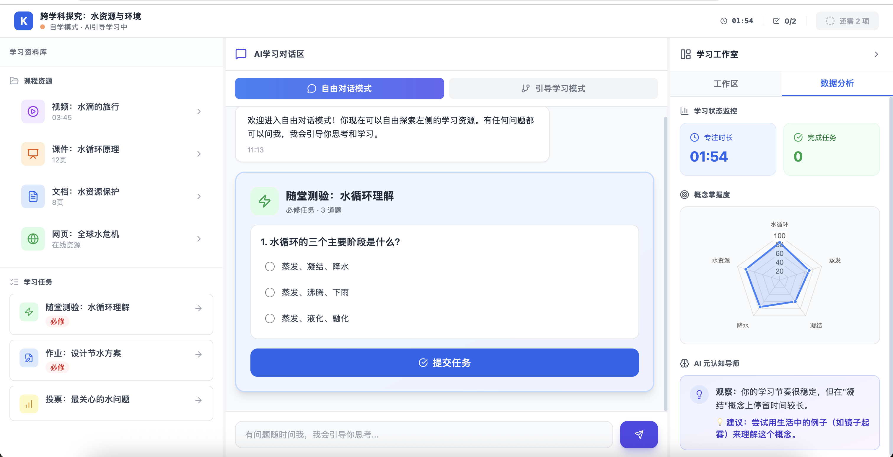

**4.2 模式二：自学模式 (The Workbench)**

**4.2.1 页面定位与布局**

**学生参与课程学习的核心界面，支持****深度探究**与**任务驱动****。 布局采用 三栏式沉浸工作台 (Immersive Workbench)，类似 NotebookLM 结合 Learn About 的体验。**

* **左侧 (25%)：资料面板 (Library) —— 资源管理与任务入口。**
* **中间 (50%)：AI 对话学习区 (Copilot Chat) —— 核心交互与知识缝合。**
* **右侧 (25%)：工作室 (Studio) —— 笔记、数据监控与元认知。**

**4.2.2 左侧：资料面板 (Library)**

* **资源列表****：**
  * **展示所有状态为 **`Open` 的资源。
  * **支持类型：PDF/Word (文档)、Video/Audio (音视频)、Web (网页链接)。**
  * **交互****：**
    * **点击资源 -> 展开为****详情模式****（覆盖当前左侧列表，或在左侧内部展开），支持点击“全屏”将资源临时最大化覆盖中间区域。**
* **互动任务 (Tasks)：**
* **展示 **`Required` 和 `Open` 的任务列表（如：测验、上传作业）。
* **交互逻辑 (Push to Chat)：**
* **点击任务 Item -> 不直接跳转新页面****。**
* **动作****：系统在****中间 AI 聊天区**自动推送一张\*\*“任务卡片”\*\*。
* **目的****：保持学生在“对话流”中完成任务，便于 AI 在任务过程中提供脚手架支持（Scaffolding）。**

**4.2.3 中间：AI 对话学习区 (Center Chat)**

* **上下文感知 (Context Awareness)：**

  * **AI 自动读取左侧****当前选中/正在查看**的 Resource ID。
  * **学生无需重复背景，直接提问“这个怎么理解？”，AI 即可基于当前文档回答。**
* **卡片式交互 (Learn About UI)：**
* **任务卡片****：由左侧点击触发。卡片内嵌互动题（选择/填空）。支持折叠/展开。**
* **资源卡片****：AI 在回答中引用的资源，以卡片形式展示，点击可反向定位到左侧资源。**
* **引导模式****：**
* **若教师预设了“引导式 Tutor”，AI 会主动抛出问题，而非被动等待。**

**4.2.4 右侧：工作室 (Studio)**

**默认可收起，提供两个 Tab：**

* **Tab A: 工作区 (Workspace)**

  * **笔记 (Notes)：支持 Markdown 笔记，支持从中间对话区“一键摘录”。**
* **Tab B: 数据可视化 (Stats)**
* **学习状态监控****：专注时间统计、概念掌握度雷达图。**
* **AI 元认知导师****：显示 AI 对学生当前学习策略的评价（如：“你阅读速度过快，建议精读第二章”）。**
